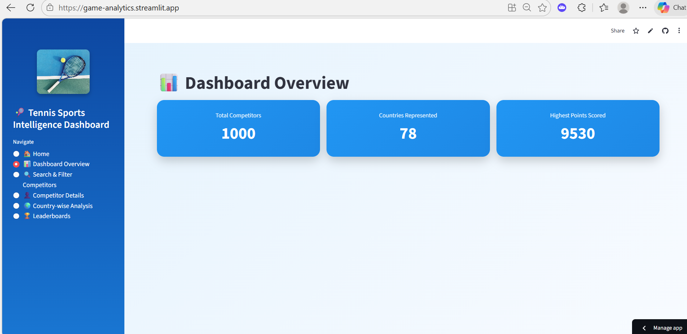
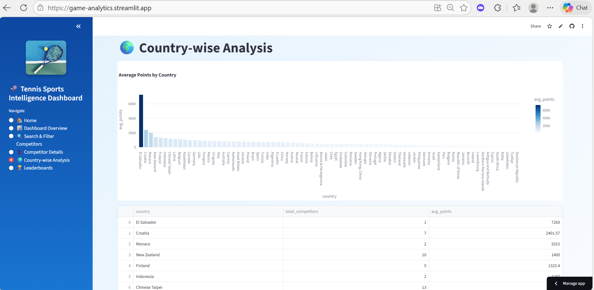

## Tennis Competition Analytics  
 
**Domain:** Sports Analytics / Data Analytics 

## Project Overview

This project delivers an end-to-end tennis analytics solution built on SportRadar competition data. It transforms raw API JSON into a structured SQL database and an interactive dashboard, enabling clear analysis of competition hierarchies, venues, and competitors for decision support in sports analytics.

## Business Context & Problem Statement

Sports organizations receive competition data in complex, fragmented formats that make it difficult to understand tournament structures, venue utilization, and player participation at scale. Without a structured analytical view, decision-makers lack reliable insights for planning events, evaluating performance, and allocating resources effectively.


## Objective

The objective of this project is to build an end-to-end tennis analytics platform that converts raw SportRadar API data into a structured, query-ready system and an interactive dashboard. Success is defined by accurate competition hierarchy mapping, reliable competitor and venue analytics, and the ability to support meaningful, exploratory analysis through SQL and visual insights.

## Data Sources & Dataset Summary

The dataset is sourced from the SportRadar API and includes competition, venue, and competitor-level data. It covers tournament hierarchies, category mappings, venue and location details, and competitor rankings and points across global tennis events.

## Data Modeling & Design

The data is structured into a relational SQL schema to support analytical querying and hierarchical analysis. Core tables represent competitions, categories, venues, complexes, and competitors, with clearly defined primary and foreign key relationships. This design enables efficient parent–child competition mapping, normalized venue location analysis, and scalable query performance.


## Analytical Approach

The analysis follows a structured, end-to-end approach that begins with transforming semi-structured API data into a normalized relational model designed for analytical querying. Competition hierarchies, venues, and competitors are modeled to reflect real-world relationships, enabling consistent aggregation and comparison across levels. Insights are derived through targeted analytical queries that focus on volume, hierarchy, ranking, and distribution, ensuring findings are directly aligned with decision-making needs rather than exploratory analysis.


## Key Insights

- ITF Men (2,198) and ITF Women (2,032) account for the highest competition volume, indicating where scheduling, operations, and participation demand are most concentrated.  
- A small number of venues—led by Buenos Aires Lawn Tennis Club (30 events)—host a disproportionate share of competitions, highlighting strategic hubs for event planning and investment.  
- Clear hierarchy between parent and sub-competitions enables unified analysis of Singles and Doubles, simplifying tournament-level reporting and performance tracking.  
- Katerina Siniakova leads global rankings with 9,530 points, demonstrating strong performance separation at the top tier and enabling benchmark-driven competitor analysis.  
- Participation spans ~1,000 competitors across 78 countries, confirming tennis as a globally distributed sport and supporting region-based engagement and growth strategies.  
  
## Dashboard Overview

The dashboard provides an executive view of the tennis competition ecosystem, summarizing competitor scale, global reach, and top performance metrics to support quick situational awareness.





## Business Impact & Use Cases

- **Operations & Event Management:** Enables organizers to identify high-activity competition categories and venue hubs, supporting smarter scheduling, capacity planning, and resource allocation.  
- **Strategy & Leadership:** Provides a consolidated view of tournament hierarchies and global participation, helping leadership assess where the sport is most active and where strategic investment or expansion is justified.  
- **Performance & Talent Analysis:** Allows analysts and performance teams to track competitor rankings and participation across events, supporting benchmarking, monitoring form, and evaluating competitive balance.  
- **Analytics & Reporting Teams:** Establishes a structured, reusable data foundation that reduces manual reporting effort and improves consistency across competition and venue-level insights.  


## Tools & Technologies

- **Data Analysis & Processing:** Python  
- **Database & Querying:** PostgreSQL, SQL  
- **Visualization & Application Layer:** Streamlit, Plotly  
- **Data Source:** SportRadar API  


## Limitations

- Data availability is constrained by the SportRadar free trial API, limiting historical depth and endpoint coverage.  
- Analysis is restricted to competition, venue, and competitor-level data and does not include match-level or player performance statistics.  


## Future Enhancements
- Integrate additional SportRadar endpoints (matches, player profiles)  
- Automate data refresh with scheduled pipelines  
- Expand dashboard filtering, drill-downs, and interactivity  
- Enable automated ranking and competition updates


## Repository Structure

```text
games-analytics-capstone/
│
├── dashboard/
│   ├── streamlit_app/
│   └── streamlit_screenshots/
│
├── data/
│   ├── raw/
│   ├── intermediate/
│   └── processed/
│
├── reports/
│   └── tennis_game_analytics_report.pdf
│
├── scripts/
│   ├── data_pipeline.py
│   ├── db_connection.py
│   └── test_db_connection.py
│
├── sql/
│   └── README.md
│
└── README.md


